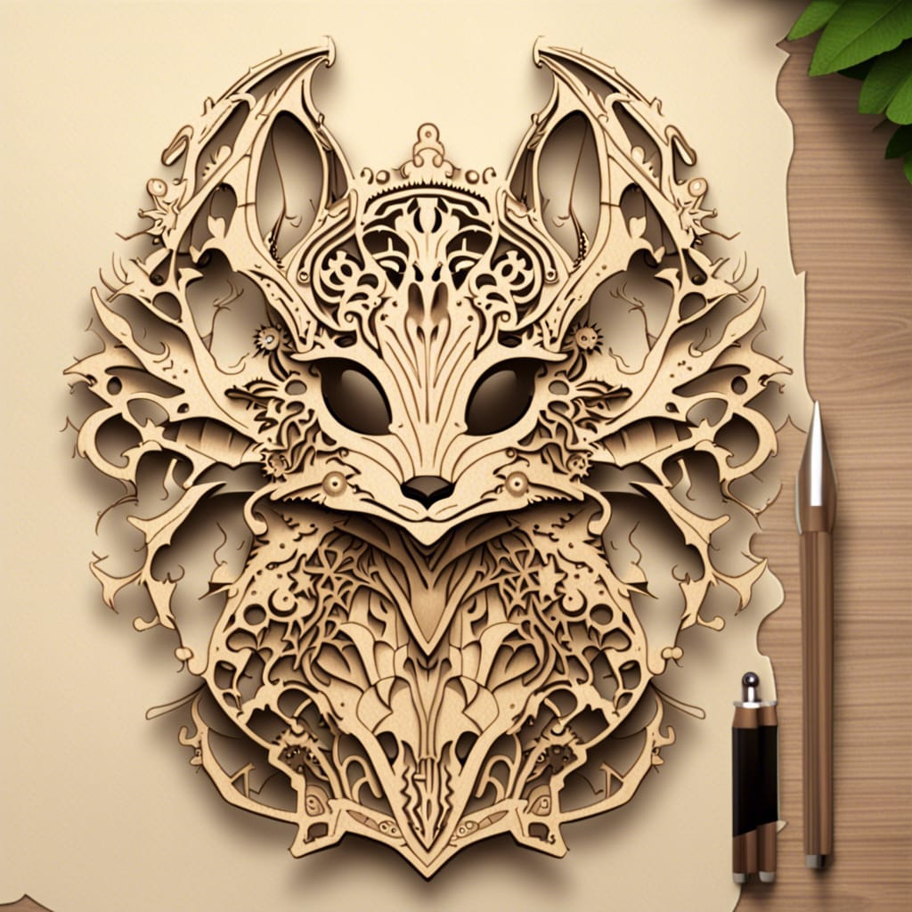
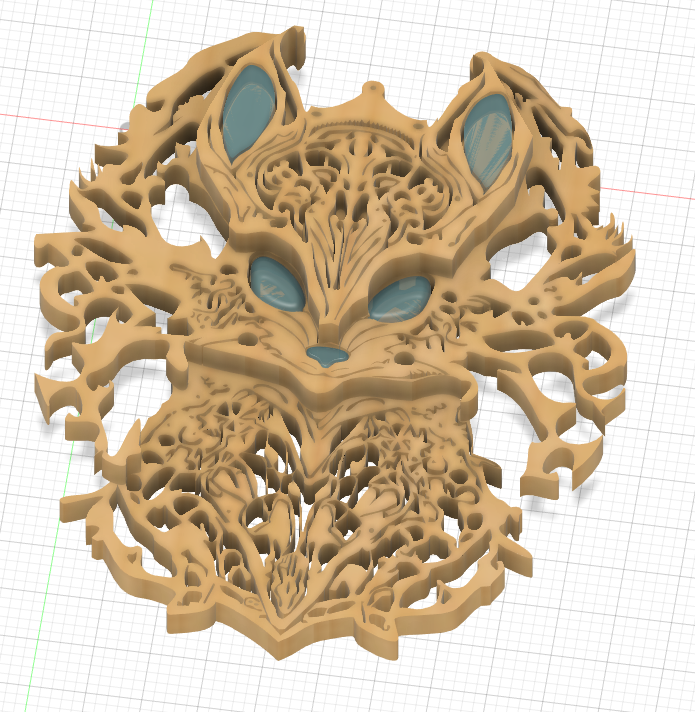

# Test de conversion d'une image généré par IA

Objectif : Convertir une image généré par IA en un objet découpable avec une machine de découpe laser

## Génération
* Générateur : https://nightcafe.studio
* Algorithme : SDXL 0.9
* Seed: 50379071
* Prompt : laser cut, svg, intrigate, one color, top view, fantasy creature, cute, schematics, magic, forest

## Travail sur l'image
* L'image a été prédécoupé avec paint.net
* Puis transformer en plusieurs couche correspondant à une zone à découper

## Vérification du résultat
Afin de vérifier si le résultat sera correcte, chaque couche est importé en SVG dans fusion 360

### [🖲️Visualiser en 3D](creatures.stl)

## Préparation du fichier 
* Chaque partie doit être préparer pour la découpe laser afin d'optimiser l'espace utilisé

## Découpe
* Les fichiers sont importés dans RdWorks 8

## Post Traitement
* Chaque partie est vernis afin de lui donner une teinte particulière
* Les parties sont collés à l'aide d'une colle à bois

## Yeux / Nez
Les yeux et les nez seront réalisés en 3D puis imprimés en résine.

